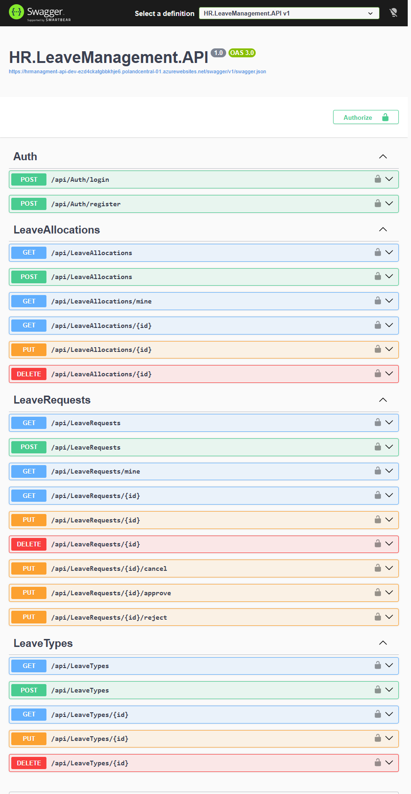

# HR Leave Management System – Clean Architecture API

🌐 **Live Demo (Swagger):**  
http://hrmanagment-api-dev-ezd4ckatgbbkhje6.polandcentral-01.azurewebsites.net/swagger/index.html

🎓 **Course Reference:**  
https://www.udemy.com/course/aspnet-core-solid-and-clean-architecture-net-5-and-up/

📜 **Certificate:**  
https://drive.google.com/file/d/1w3EPjJ_CK8lfnlYPYxWTMvT1B5gScSgW/view?usp=drive_link

---

## 📸 Swagger Preview

---

## Overview

This is a **production-ready ASP.NET Core Web API** built using **Clean Architecture**, **SOLID principles**, and **CQRS with MediatR**.

The project demonstrates real-world backend development practices including:

- Layered architecture
- Authentication & Authorization (JWT + Identity)
- Validation pipeline
- Logging & Exception handling
- Auditing
- Unit testing
- Azure cloud deployment
- Application Insights monitoring

The solution is structured into isolated layers with clear separation of concerns to ensure maintainability, scalability, and testability.

---

## Architecture

The project follows a **6-Layer Clean Architecture** approach:

### 1️⃣ Domain Layer
- Core Entities
- Identity Entities (ApplicationUser, ApplicationRole)
- Auditable Base Entity
- No external dependencies

---

### 2️⃣ Application Layer
- CQRS (Commands & Queries)
- MediatR Handlers
- FluentValidation Validators
- Pipeline Behaviors:
  - Logging Behavior
  - Validation Behavior
- DTOs & Models
- AutoMapper Profiles
- Custom Exceptions
- Contracts (Interfaces for Persistence, Identity, Email, etc.)
- Role Constants

---

### 3️⃣ Persistence Layer
- EF Core DbContext
- Entity Configurations (Fluent API)
- Generic Repository Pattern
- Specific Repositories
- Migrations
- Database Seeding
- Audit handling (CreatedBy / ModifiedBy)

---

### 4️⃣ Identity Layer
- ASP.NET Core Identity
- JWT Authentication
- Role-Based Authorization
- AuthService
- UserService
- CurrentUserService
- Identity DbContext
- Roles & Admin Seeding

---

### 5️⃣ Infrastructure Layer
- Third-party Email Service Implementation
- External Service Models
- Implements Application Contracts

---

### 6️⃣ API Layer
- Controllers
- Global Exception Middleware
- Logging Configuration
- Extension-based service registration
- Clean Program.cs

---

## Key Features

- Clean Architecture
- SOLID Principles
- CQRS Pattern
- MediatR
- FluentValidation
- Repository Pattern
- ASP.NET Identity
- JWT Authentication
- Auditing System
- Global Exception Handling
- Unit Testing with Moq
- Azure Deployment
- Application Insights Integration

---

## Cloud Deployment

The API is deployed to **Azure App Service**.

Monitoring and logs are handled using:

- Azure Application Insights
- Structured Logging
- Centralized Exception Handling

---

## 🧪 Testing

The project includes focused Unit Tests targeting the most critical business logic inside the Application layer.

### What Is Covered

✔ Command Handlers (Create / Update / Delete flows)  
✔ Query Handlers  
✔ Business Rule validations  
✔ Failure scenarios (BadRequest, NotFound, Forbidden cases)  
✔ Authorization-related rules  
✔ Audit behavior verification  

Testing approach focuses on **behavior and business logic**, not framework internals.

### Testing Strategy

- Unit Testing for Application layer
- Mocking dependencies using Moq
- Clear Arrange / Act / Assert structure
- Edge case validation
- Isolated testing without database dependency

The goal is to ensure reliability, maintainability, and safe refactoring.

---

## Tech Stack

- ASP.NET Core
- Entity Framework Core
- MediatR
- FluentValidation
- AutoMapper
- SQL Server
- ASP.NET Identity
- JWT
- Moq
- Azure App Service
- Azure Application Insights

---

## Author

**Youssef Mohammed**

---
